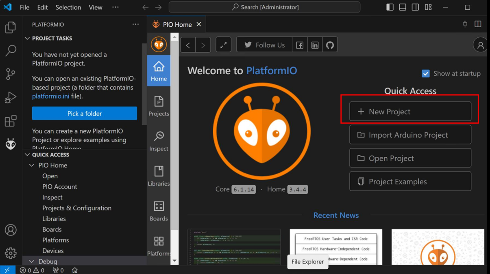

# Controlling Servo Motors with the Arduino Uno R4

UB IEEE x DREAM

Please join our Discord:


---

## Installing VSCode

Visual Studio Code is a powerful text editor. VS Code's powerful and popular extension ecosystem can give it many of the powers of a fully-fledged IDE. You can download Visual Studio Code from here: https://code.visualstudio.com/download.


---

## Installing PlatformIO

Install PlatformIO as a VSCode extension:


--

## Comparison of Arduino IDE vs. VSCode + PlatformIO


---

## Creating a New Project




---

## Upgrade Core + Update Dependencies


---

## Arduino Software Convention
Arduino main:

```cpp
int main(void){
    init();
    setup();
    while (true){
        loop();
    }
    return 0;
}
```

---

## The `platformio.ini` Configuration File

```.ini
[env:uno_r4_wifi]
platform = renesas-ra
board = uno_r4_wifi
framework = arduino
```

---

## Blink - the `Hello, World!` of Hardware

```cpp
#include <Arduino.h>

// put function declarations here:
int myFunction(int, int);

void setup() {
  // put your setup code here, to run once:
  int result = myFunction(2, 3);
}

void loop() {
  // put your main code here, to run repeatedly:
  digitalWrite(LED_BUILTIN, HIGH);
  delay(1000);
  digitalWrite(LED_BUILTIN, LOW);
  delay(1000);
}

// put function definitions here:
int myFunction(int x, int y) {
  return x + y;
}
```

---

## Connecting your Servo Motor

  
<sub>Diagram from [Makerguides](https://www.makerguides.com/servo-arduino-tutorial/) by Benne de Bakker, licensed under [CC BY-NC-SA 4.0](https://creativecommons.org/licenses/by-nc-sa/4.0/).</sub>

---


### Installing Libraries Using PlatformIO


---

### Installing Libraries Using PlatformIO


---

### Installing Libraries Using PlatformIO


---

## Controlling the Servo

```cpp
#include <Arduino.h>
// Include Servo Library
#include <Servo.h>

Servo myServo;

void setup() {
  // Setup pin 9
  myServo.attach(9);
}

void loop() {
  // control the servo
  myServo.write(0);
  delay(1000);
  myServo.write(90);
  delay(1000);
}

```

---
## Summary of Syntax
Include the Servo Library:
```cpp
#include <Servo.h>
```

Setup your Arduino pin, PWM pins are signaled by "~":
```cpp
myServo.attach(PWM Pin);
```

Control the Servo Motor:
```cpp
myServo.write(Angle Measurement);
```
---
## C++ Looping

```cpp
for (int i = 0; i < 10; i++)
{
  // Loop here
}
```
---
## Coding Challenge
### Can you use a loop to gradually change the servo motor?

Remember how to loop from the previous slide, and alter this code to move the servo from 0&deg; to 180&deg;:
```cpp
for (int i = 0; i < 10; i++)
{
  // Loop here
}
```

Once you have the servo rotate from 0&deg; &rarr; 180&deg; can you make it go from 180&deg; &rarr; 0&deg;?

**Hint**: You will need to change your starting value, condition, and the increment!

---
## Coding Challenge Answer:
```cpp
  for (int pos = 0; pos < 180; pos++)
  {
    myServo.write(pos);
    delay(50);
  }
  for (int pos = 180; pos > 0; pos--)
  {
    myServo.write(pos);
    delay(50);
  }
```
---
# How do Servo Motors Work?
To answer that question, first we must learn what Pulse Width Modulation (PWM) is!

---
## Pulse Width Modulation (PWM)
PWM is used to control power using digital signals. Instead of varying voltage, electronics use PWM signals. The signal is rapidly switched on and off at a fixed frequency, with a set **duty cycle**. Duty cycle is simply the percentage of time the signal is on.

---
## Duty Cycles


---
## Servo Motor Data Wire
Servo motors operate at 50Hz (20ms period). To control a servo motor, we will send pulses via the signal wire. Every 20ms a pulse is sent with the width of:
- ~0.5ms: 0&deg;
- ~1.5ms: 90&deg;
- ~2.5ms: 180&deg;
---
## writeServo() Function

```cpp
#include <Arduino.h>

const int servoPin = 9;

void writeServo(int angle) {
  // Map angle to pulse width
  int pulseWidth = map(angle, 0, 180, 500, 2400);
  // Signal HIGH for width
  digitalWrite(servoPin, HIGH);
  delayMicroseconds(pulseWidth);
  // Signal LOW for remaining
  digitalWrite(servoPin, LOW);
  delayMicroseconds(20000 - pulseWidth);
}

void setup() {
  pinMode(servoPin, OUTPUT);
}

void loop() {
  for (int i = 0; i < 50; i++) {
    writeServo(0);
  }
  for (int i = 0; i < 50; i++) {
    writeServo(90);
  }
  for (int i = 0; i < 50; i++) {
    writeServo(180);
  }
}
```
---
## Which is better?

It's nice to see how these servo motors work, but this application is unrealistic. There are some errors in our approach:

- Blocking Delays: Can't do anything else because we need to send a constant pulse.
- Pulse Range: Different servo motors have different ranges. We are assuming they are all the same.
- Software Timing: Delays are software-timed, meaning they are not as percise as hardware. This can lead to various jittering issues.

### So, we use libraries!

---

## Additional <!-- Learning --> Resources

- VSCode Documentation: https://code.visualstudio.com/Docs
- PlatformIO's Documentation: https://docs.platformio.org/en/latest/
- Arduino Documentation: https://docs.arduino.cc/
- C++ Programming Language: https://www.learncpp.com/
- The C Programming Language by Brian Kernighan and Dennis Ritchie: https://en.wikipedia.org/wiki/The_C_Programming_Language
- Purchase the Arduino Uno R4 Wifi (US Store): https://store-usa.arduino.cc/products/uno-r4-wifi